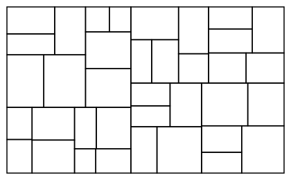

# procedural-city-generator

Procedural generation of building floor plans and city blocks using shape grammars and an L-system, exported to an interactive 3D viewer built with Three.js.

Independent portfolio project combining an architecture background with computational geometry.

## Status

Early development. Milestone 1, shape grammar floor plan generation, is complete. Milestone 2, L-system street network, is next.

## What's implemented

- Recursive rectangle subdivision for building floor plans (shape grammar), deterministic given a seed

## Notable details

- Rooms split along whichever axis is longer, not a fixed axis, so a wide footprint does not turn into a strip of narrow rooms.
- Minimum room size is a width and height limit rather than an area limit, so a large but very thin sliver room cannot pass the check.
- A single seeded `random.Random` instance is threaded through the recursion instead of the global `random` module, so a given seed reliably reproduces the same layout.

## Results

A 40m by 24m footprint subdivided with seed 7, minimum room size 3m by 3m, max depth 6:

Full generated data: [`generator/examples/output/sample_floorplan.json`](generator/examples/output/sample_floorplan.json)

## Stack

- `generator/`: Python 3, numpy, pytest
- `viewer/`: TypeScript, Three.js, Vite, added in a later milestone

## Documentation

Algorithm details (shape grammar rules, L-system rules, geometry math) live in `docs/algorithm-notes.md`.

## License

MIT, see `LICENSE`.
