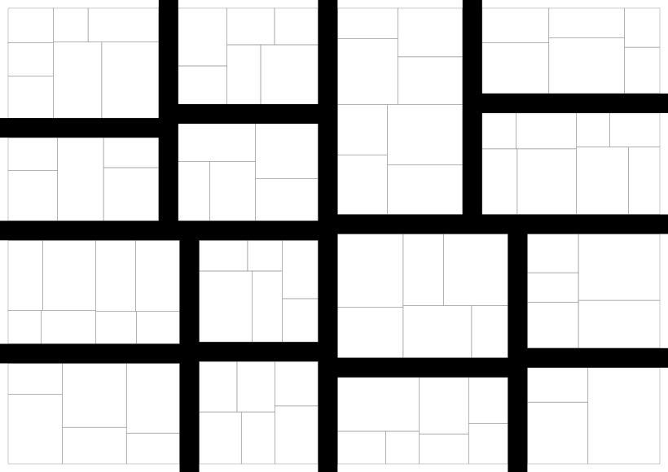
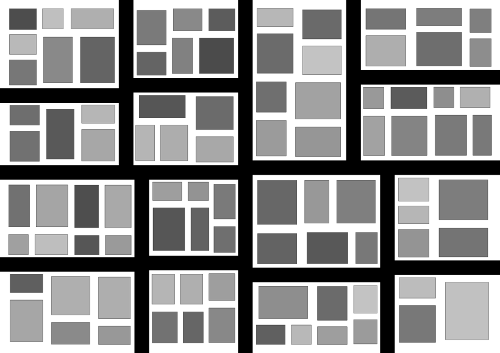

# procedural-city-generator

Procedural generation of building floor plans and city blocks using shape grammars and an L-system, exported to an interactive 3D viewer built with Three.js.

Independent portfolio project combining an architecture background with computational geometry.

## Status

Early development. Milestones 1 through 3 are complete: shape grammar floor plans, the street network with parcel division, and composing the two into full city blocks. Milestone 4, extruding the 2D footprints into 3D geometry for export, is next.

## What's implemented

- Recursive rectangle subdivision for building floor plans (shape grammar), deterministic given a seed
- Recursive street cuts dividing a district into blocks, and each block into individual parcels, deterministic given a seed
- Placing one building per parcel: a footprint inset by a configurable density, a height drawn from a configured range, and a full floor plan generated on that footprint

## Notable details

- Rooms split along whichever axis is longer, not a fixed axis, so a wide footprint does not turn into a strip of narrow rooms.
- Minimum room size is a width and height limit rather than an area limit, so a large but very thin sliver room cannot pass the check.
- A single seeded `random.Random` instance is threaded through the recursion instead of the global `random` module, so a given seed reliably reproduces the same layout.
- Streets and parcels reuse the same recursive splitting primitive as the room subdivision above instead of a separate implementation; a street cut differs only in that it removes a `street_width` strip from the middle of the split. See `docs/algorithm-notes.md` for why this stands in for a full turtle graphics L-system.
- Building footprints are inset from their parcel by a density that scales both dimensions toward the parcel's center, not an area fraction, since that reads directly as a setback instead of needing to be converted back to one.
- A building's floor plan is generated by calling the same subdivision primitive used for parcels, just parameterized differently, rather than a separate room generation path.

## Results

A 40m by 24m footprint subdivided with seed 7, minimum room size 3m by 3m, max depth 6:

Full generated data: [`generator/examples/output/sample_floorplan.json`](generator/examples/output/sample_floorplan.json)

A 200m by 140m district cut into blocks with a seed of 11, 6m wide streets, minimum block size 25m by 25m, then each block divided into parcels with a minimum size of 9m by 9m:

Full generated data: [`generator/examples/output/sample_street_network.json`](generator/examples/output/sample_street_network.json)

The same district with a building placed on every parcel, density 0.8, height range 6m to 18m, shaded darker for taller buildings:

Full generated data: [`generator/examples/output/sample_block.json`](generator/examples/output/sample_block.json)

## Stack

- `generator/`: Python 3, numpy, pytest
- `viewer/`: TypeScript, Three.js, Vite, added in a later milestone

## Documentation

Algorithm details (shape grammar rules, L-system rules, geometry math) live in `docs/algorithm-notes.md`.

## License

MIT, see `LICENSE`.
